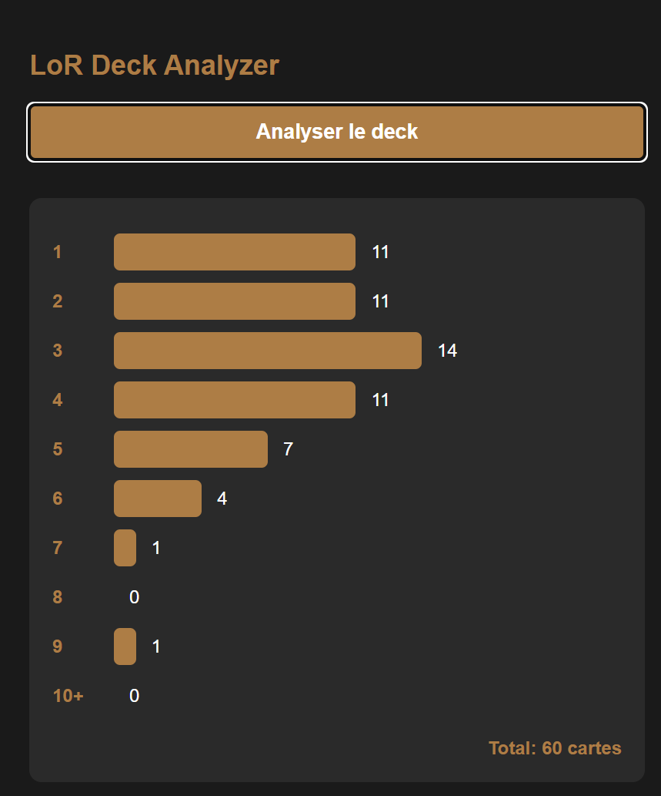

# LoR Deck Analyzer

Une extension Chrome pour analyser la distribution des coûts en encre des decks sur [LorCards.fr](https://www.lorcards.fr).



## Fonctionnalités

- Analyse automatique de la distribution des coûts en encre des cartes
- Visualisation graphique avec des barres de progression
- Support des coûts de 1 à 10+ encre
- Calcul du nombre total de cartes
- Interface utilisateur intuitive
- Fonctionne uniquement sur l'éditeur de deck de LorCards.fr

## Installation

### Pour les utilisateurs

1. Téléchargez le code source (via le bouton "Code > Download ZIP" ou en clonant le repository)
2. Décompressez le dossier si nécessaire
3. Ouvrez Chrome et accédez à `chrome://extensions/`
4. Activez le "Mode développeur" (en haut à droite)
5. Cliquez sur "Charger l'extension non empaquetée"
6. Sélectionnez le dossier de l'extension

### Pour les développeurs

```bash
git clone https://github.com/Gon3s/loRDeckAnalyzer.git
cd lor-deck-analyzer
```

## Utilisation

1. Visitez la page d'édition de deck sur [LorCards.fr](https://www.lorcards.fr)
2. Cliquez sur l'icône de l'extension dans la barre d'outils Chrome
3. Cliquez sur le bouton "Analyser le deck"
4. Visualisez la distribution des coûts en encre de votre deck

## Structure du projet

```
lor-deck-analyzer/
├── manifest.json      # Configuration de l'extension
├── popup.html        # Interface utilisateur
├── popup.js         # Logique de l'extension
└── icons/          # Icônes de l'extension
    ├── icon16.png
    ├── icon48.png
    └── icon128.png
```

## Développement

### Prérequis

- Google Chrome
- Connaissance basique de JavaScript
- Un éditeur de code (VS Code recommandé)

### Modification du code

1. Le fichier `popup.js` contient la logique principale
2. `popup.html` définit l'interface utilisateur et les styles
3. `manifest.json` configure les permissions et les métadonnées de l'extension

### Debugging

1. Ouvrez l'extension
2. Clic droit > Inspecter
3. Utilisez les outils de développement Chrome pour débugger

## Contribution

Les contributions sont bienvenues ! Pour contribuer :

1. Forkez le projet
2. Créez une branche pour votre fonctionnalité (`git checkout -b feature/AmazingFeature`)
3. Committez vos changements (`git commit -m 'Add some AmazingFeature'`)
4. Poussez vers la branche (`git push origin feature/AmazingFeature`)
5. Ouvrez une Pull Request

## Licence

Distribuée sous la licence MIT. Voir [LICENSE](./LICENSE) pour plus d'informations.

## Versions

- **1.0.0** (17/11/2024)
  - Version initiale
  - Analyse des coûts en encre
  - Interface graphique basique
